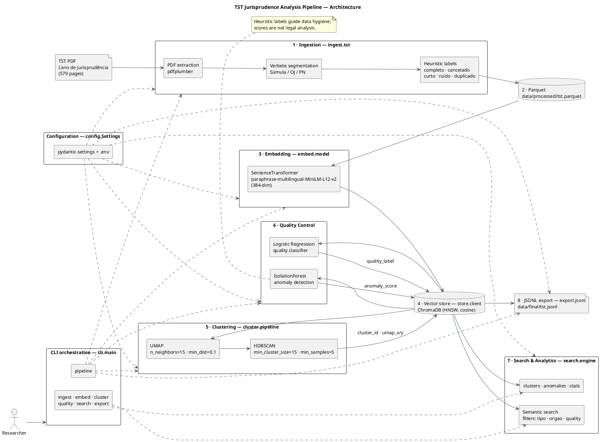

# TST Jurisprudence Analysis Pipeline - Capstone Project

## Overview

This capstone project builds an end-to-end data pipeline over the **Livro de
Jurisprudência do TST** (the official compendium of the Brazilian Superior Labor
Court), turning a 579-page PDF into a structured, searchable, quality-controlled
knowledge base.

The pipeline ingests the PDF and segments it **verbete by verbete** (Súmulas,
Orientações Jurisprudenciais and Precedentes Normativos), keeping only the
**current wording** of each verbete. It then generates multilingual embeddings,
stores them in a vector database, organizes them with dimensionality reduction
and clustering, flags low-quality/malformed records, detects anomalies, and
exposes the whole corpus through semantic search and analytics commands.

**Main goals:**

- Convert an unstructured legal PDF into a clean, machine-readable dataset
  (JSONL / Parquet).
- Enable **semantic search** by meaning rather than keywords, across Portuguese
  legal text.
- Surface **structure** in the corpus (themes/clusters) and **quality issues**
  (cancelled, duplicated, truncated or noisy verbetes).
- Provide a reproducible, tested, CI-verified pipeline.

## Domain Statement

- **Domain:** Brazilian labor law (*Direito do Trabalho*), specifically the
  jurisprudence of the **Tribunal Superior do Trabalho (TST)**.
- **Corpus:** the official *Livro de Súmulas, Orientações Jurisprudenciais e
  Precedentes Normativos* — [official source](https://www.tst.jus.br/livro-de-sumulas-ojs-e-pns).
- **Entity modeled:** a **verbete**, i.e. a single numbered normative statement,
  carrying a type (`sumula`, `oj`, `precedente`), an issuing body (`orgao`), a
  code (`codigo`) and a theme (`tema`).
- **Problem addressed:** the source is a large, Portuguese-language, legally
  dense PDF where verbetes are interleaved with their full historical redactions
  and cross-references, making manual lookup and analysis slow. This project
  converts it into a normalized, searchable, deduplicated dataset.
- **Intended users:** legal researchers, law students, and professionals who need
  to discover related precedents, explore themes, or audit corpus quality.
- **Scope and limitations:**
  - Quality labels are **heuristic** and used for data hygiene, **not** legal
    analysis. Cancellation/revocation is detected from header keywords
    (`cancelad`, `revogad`, etc.) and may not capture every case.
  - The embedding model is general-purpose multilingual; it is not fine-tuned on
    legal language.
  - This project is an educational data-engineering exercise and **does not
    provide legal advice**.

## Architecture

```
Ingestion (PDF → verbetes) → Embeddings (paraphrase-multilingual-MiniLM-L12-v2)
→ ChromaDB (HNSW, cosine) → UMAP + HDBSCAN → Quality Control (LogReg + IsolationForest)
→ JSONL Export + CLI Search/Analytics
```

A detailed component diagram is available as PlantUML source below:



Each verbete is segmented from the PDF keeping only the current wording (the book
also reproduces the full history of each verbete), cutting at
`Histórico:`/repeated headers and stopping at the `Índice Remissivo` (Subject
Index).

## Requirements

- Python 3.12+
- 16GB+ RAM (CPU-only by default)
- 10GB+ free disk (model weights + vector store)
- No GPU required (`EMBEDDING_DEVICE=cpu`)

## Configuration

Configuration is centralized in [`src/config.py`](src/config.py) and powered by
`pydantic-settings`, so every value can be overridden through **environment
variables** or a **`.env`** file placed in `capstone/` (not versioned):

```bash
# capstone/.env (optional)
EMBEDDING_BATCH_SIZE=32
EMBEDDING_DEVICE=cpu
COLLECTION_NAME=amazon_reviews
ANOMALY_CONTAMINATION=0.05
```

Key settings:

| Variable | Default | Description |
|----------|---------|-------------|
| `EMBEDDING_MODEL` | `sentence-transformers/paraphrase-multilingual-MiniLM-L12-v2` | Sentence-transformer used to embed verbetes |
| `EMBEDDING_DIM` | `384` | Embedding dimension |
| `EMBEDDING_BATCH_SIZE` | `32` | Batch size for embedding |
| `EMBEDDING_DEVICE` | `cpu` | `cpu` or `cuda` |
| `TST_PDF_PATH` | `data/raw/livrointernet12pdf.pdf` | Input PDF path |
| `VERBETE_MIN_TEXT` | `20` | Drop verbetes shorter than this |
| `VERBETE_RUIDO` / `VERBETE_CURTO` | `30` / `120` | Thresholds for `ruido`/`curto` labels |
| `COLLECTION_NAME` | `amazon_reviews` | ChromaDB collection (kept for backwards compatibility) |
| `HNSW_SPACE` | `cosine` | Vector index distance metric |
| `UMAP_N_NEIGHBORS`, `UMAP_MIN_DIST` | `15`, `0.1` | UMAP projection |
| `HDBSCAN_MIN_CLUSTER_SIZE`, `HDBSCAN_MIN_SAMPLES` | `15`, `5` | HDBSCAN clustering |
| `ANOMALY_CONTAMINATION` | `0.05` | IsolationForest contamination |
| `EXPORT_PATH` | `data/final/tst.jsonl` | JSONL export destination |

Project directories (`data/raw`, `data/processed`, `data/final`, `models`,
`chroma_db`) are created automatically on import.

## Setup

From the repository root:

```bash
cd capstone

# 1. Create and activate a virtual environment
python -m venv .venv
source .venv/bin/activate        # Windows: .venv\Scripts\activate

# 2. Upgrade packaging tools
pip install --upgrade pip setuptools

# 3. Install the package with dev dependencies
pip install -e ".[dev]"
```

Download the source PDF from the [official page](https://www.tst.jus.br/livro-de-sumulas-ojs-e-pns)
and place it at `data/raw/livrointernet12pdf.pdf` (it is not versioned).

Run the full pipeline:

```bash
capstone pipeline -i data/raw/livrointernet12pdf.pdf
```

## Data

- Official source: [Book of Precedents, OJs and PNs](https://www.tst.jus.br/livro-de-sumulas-ojs-e-pns)
- File: `data/raw/livrointernet12pdf.pdf` (579 pages, not versioned)
- Extracted corpus: ~1058 verbetes (~703 OJs, 235 Precedents, 120 Normative Precedents)
- A small offline fixture (`tests/fixtures/tst-sample.pdf`, 22 verbetes) is
  committed so that CI can run the pipeline without network access.

## Usage

### CLI

```bash
# Full pipeline (ingest -> embed -> cluster -> quality -> export)
capstone pipeline -i data/raw/livrointernet12pdf.pdf

# Individual steps
capstone ingest -i data/raw/livrointernet12pdf.pdf -o data/processed/tst.parquet
capstone embed --batch-size 32 --id-prefix verbete
capstone cluster
capstone quality --contamination 0.05
capstone export -o data/final/tst.jsonl

# Search and analytics
capstone search "adicional de insalubridade" --k 10 --tipo oj --orgao SBDI-1
capstone clusters --top-terms 5
capstone anomalies --limit 20
capstone stats
```

`capstone pipeline` accepts `--skip-ingest`, `--skip-embed`, `--skip-cluster`,
`--skip-quality` and `--skip-export` to resume from any stage.

### Makefile shortcuts

```bash
make install    # pip install -e ".[dev]"
make pipeline   # full pipeline
make ingest embed cluster quality export
make search clusters anomalies stats
make test lint clean rebuild
```

## JSONL Export

Each line of `data/final/tst.jsonl` is an enriched verbete:

```json
{
  "id": "verbete_0",
  "doc_id": "sumula_6",
  "tipo": "sumula",
  "orgao": "TST",
  "codigo": 6,
  "tema": "Quadro de carreira. Homologação. Equiparação salarial",
  "text": "...",
  "text_len": 353,
  "source": "livrointernet12pdf.pdf",
  "quality_label": "completo",
  "cluster_id": 12,
  "anomaly_score": 0.374641,
  "umap_x": 5.487961,
  "umap_y": 9.684173
}
```

## Heuristic Labels (Quality Control)

| Label | Rule |
|-------|------|
| cancelado (cancelled) | header indicates `cancelad`, `(negativo)`, `revogad`, `cassad`, `superad` |
| duplicado (duplicate) | normalized body repeated across more than one verbete |
| ruido (noise) | text shorter than 30 characters |
| curto (short) | text between 30 and 119 characters |
| completo (complete) | text with 120+ characters |

## Embedding Model

- **paraphrase-multilingual-MiniLM-L12-v2** (118M params, 384-dim, multilingual)

## Clustering

- UMAP: n_neighbors=15, min_dist=0.1, metric=cosine
- HDBSCAN: min_cluster_size=15, min_samples=5, metric=euclidean

## Anomaly

- IsolationForest: n_estimators=200, contamination=0.05

## Project Structure

```
capstone/
├── src/
│   ├── cli/main.py          # Click CLI (ingest, embed, cluster, quality, search, export, pipeline)
│   ├── config.py            # pydantic-settings configuration
│   ├── ingest/tst.py        # PDF → verbetes (segmentation + heuristic labels)
│   ├── embed/model.py       # SentenceTransformer embeddings
│   ├── store/client.py      # ChromaDB client/collection
│   ├── cluster/pipeline.py  # UMAP + HDBSCAN
│   ├── quality/classifier.py# LogReg quality classifier
│   ├── quality/anomaly.py   # IsolationForest anomaly detection
│   ├── search/engine.py     # Semantic search + analytics
│   ├── export/jsonl.py      # JSONL export
│   └── app/main.py          # Package entry point
└── tests/                   # Pytest suite + offline PDF fixture
```

## Code Quality

```bash
black .
mypy .
pytest tests/
```

CI runs `black --check`, `mypy`, the test suite, and a mini offline ETL on every
push to `main`.
