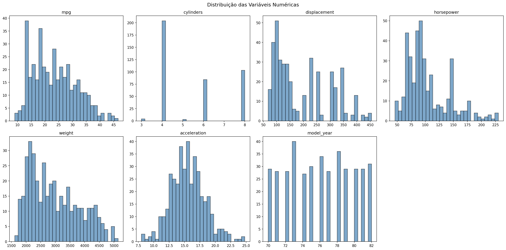
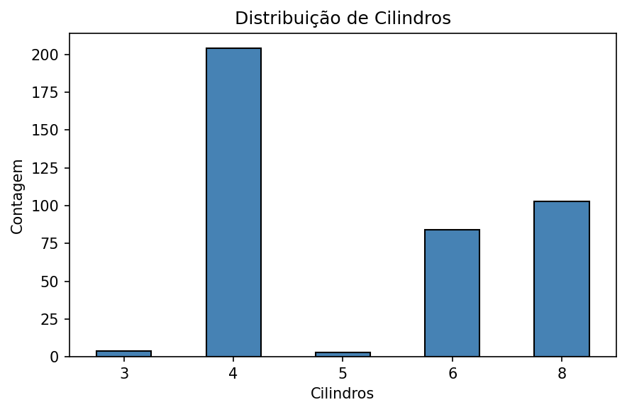
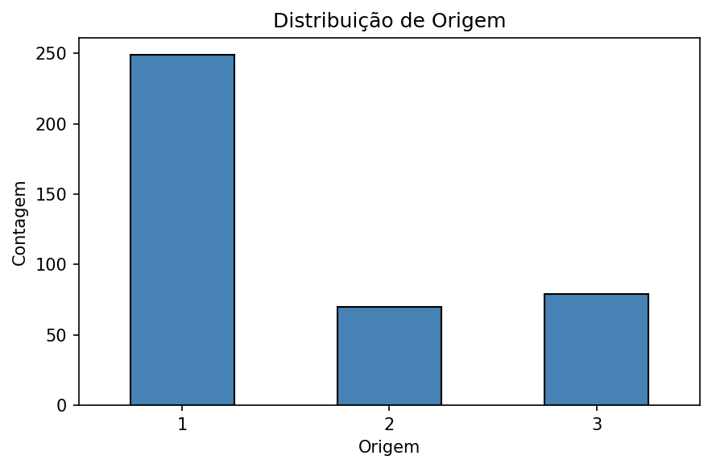
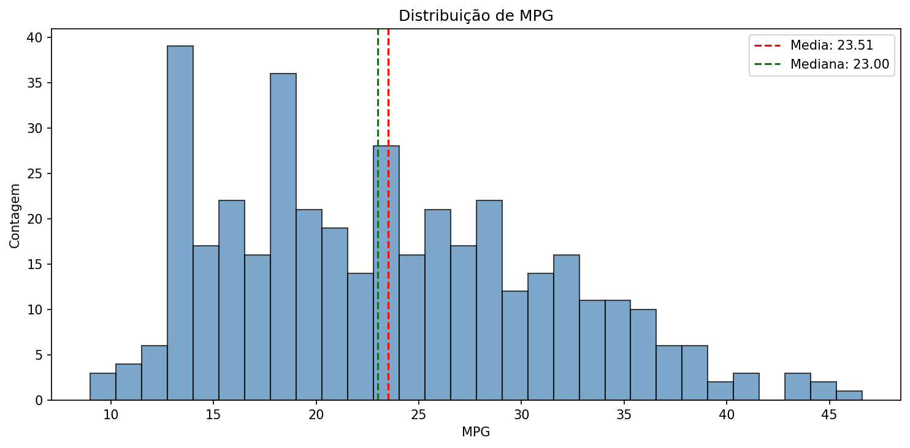
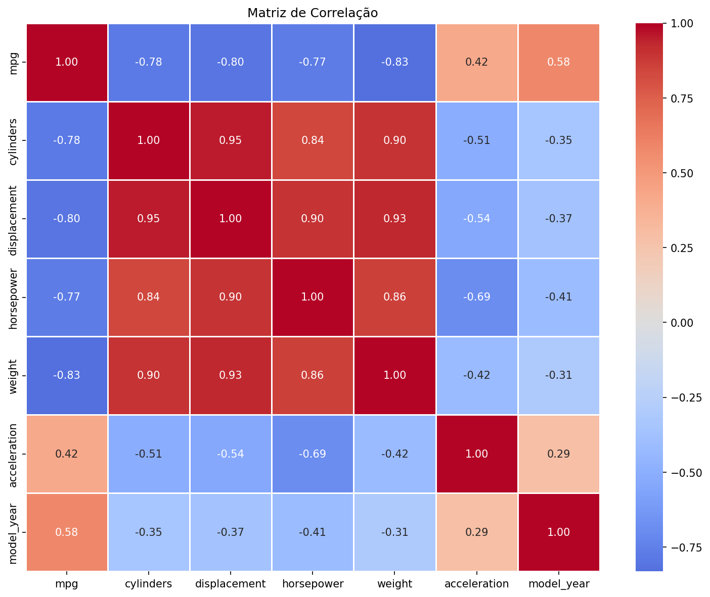
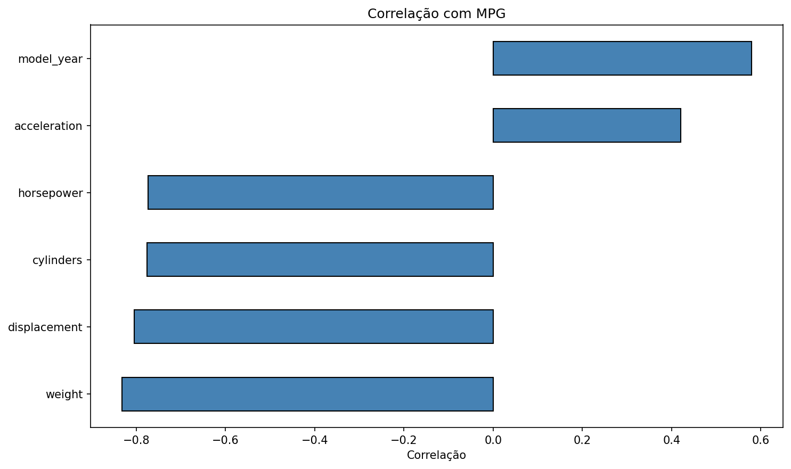
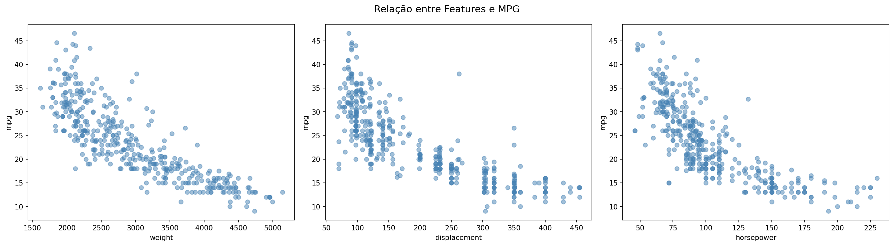
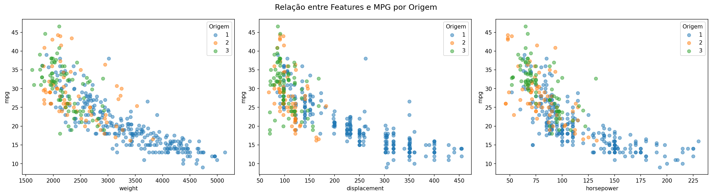
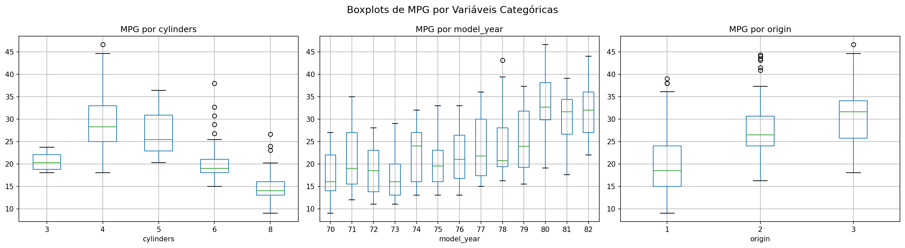

# Atividade 2

## Fundamentos

Nesta atividade, trabalhei com o **Automobile MPG Dataset**, um conjunto de dados clássico de machine learning que contém informações de consumo de combustível em milhas por galão (MPG) e outros atributos para vários modelos de carros.

### Sobre o Dataset

- **398 instâncias** (veículos)
- **8 atributos** incluindo MPG, cilindros, cilindrada, potência, peso, aceleração, ano do modelo e origem

### Estrutura dos Dados

| Atributo | Tipo | Descrição |
|----------|------|-----------|
| **mpg** | float64 | Consumo de combustível em milhas por galão |
| **cylinders** | int64 | Número de cilindros do motor |
| **displacement** | float64 | Cilindrada do motor (polegadas cúbicas) |
| **horsepower** | float64 | Potência do motor (cavalo-fogão) |
| **weight** | int64 | Peso do veículo (libras) |
| **acceleration** | float64 | Tempo para acelerar de 0 a 60 mph (segundos) |
| **model_year** | int64 | Ano do modelo (anos 70-80) |
| **origin** | int64 | Origem do veículo (1: EUA, 2: Europa, 3: Japão) |

## Descrição da Minha Análise

Realizei a análise exploratória usando Python com as bibliotecas **pandas**, **numpy**, **matplotlib** e **seaborn**. O notebook `auto-mpg-analysis.ipynb` contém todo o código e análise completa que desenvolvi.

## Resultados da Análise

### 1. Visão Geral dos Dados

O dataset possui **398 registros** e **9 colunas**. A coluna `horsepower` foi convertida de string para numérico, com valores nulos preenchidos pela mediana.

### 2. Estatísticas Descritivas

| Atributo | Média | Desvio Padrão | Mínimo | Máximo |
|----------|-------|---------------|--------|--------|
| mpg | 23.51 | 7.82 | 9.00 | 46.60 |
| cylinders | 5.45 | 1.70 | 3.00 | 8.00 |
| displacement | 193.43 | 104.27 | 68.00 | 455.00 |
| weight | 2970.42 | 846.84 | 1613 | 5140 |
| acceleration | 15.57 | 2.76 | 8.00 | 24.80 |
| model_year | 76.01 | 3.70 | 70.00 | 82.00 |

### 3. Distribuição das Variáveis Numéricas

**Observações:**
- A variável `mpg` apresenta distribuição assimétrica à direita (positiva)
- A maioria dos carros tem entre 4 e 8 cilindros
- A distribuição do ano do modelo é relativamente uniforme

### 4. Distribuição de Cilindros

A maioria dos veículos possui 4 cilindros (204 veículos), seguidos por 8 cilindros (103) e 6 cilindros (84).

### 5. Distribuição de Origem

- **EUA (1):** 249 veículos (62.6%)
- **Europa (2):** 70 veículos (17.6%)
- **Japão (3):** 79 veículos (19.8%)

### 6. Distribuição de MPG

- **Média:** 23.51 MPG
- **Mediana:** 23.00 MPG
- A distribuição é **assimétrica à direita**, indicando que a maioria dos carros tem consumo moderado

### 7. Matriz de Correlação

### 8. Correlação com MPG

Identifiquei as correlações com MPG (consumo de combustível):

| Feature | Correlação |
|---------|-----------|
| model_year | +0.58 |
| acceleration | +0.42 |
| horsepower | -0.77 |
| cylinders | -0.78 |
| displacement | -0.80 |
| weight | -0.83 |

**Observações importantes:**
- **Weight** (peso) tem a maior correlação negativa com MPG (r = -0.83), indicando que carros mais pesados consomem mais combustível
- **Displacement** (cilindrada) também tem forte correlação negativa (r = -0.80)
- **Model_year** tem correlação positiva moderada (r = 0.58), sugerindo que carros mais novos são mais eficientes

### 9. Relação entre Features e MPG

### 10. Relação por Origem

Os scatter plots revelam que:
- Carros de origem **europeia e japonesa** tendem a ter maior MPG para o mesmo peso
- Existe uma **relação linear negativa** clara entre peso/potência e MPG

### 11. Boxplots por Variáveis Categóricas

**Descobertas:**
- Carros com **menos cilindros** tendem a ter maior MPG
- A eficiência de combustível **melhorou significativamente** entre os anos 70 e 80
- Carros de origem **europeia e japonesa** apresentam MPG médio superior aos carros americanos

## Tabelas Estatísticas

### Estatísticas Descritivas
Arquivo: `tabelas/auto-mpg_estatisticas.csv`

### Correlação com MPG
Arquivo: `tabelas/auto-mpg_correlacao_mpg.csv`

### Primeiras Linhas
Arquivo: `tabelas/auto-mpg_primeiras_linhas.csv`

### Valores Nulos
Arquivo: `tabelas/auto-mpg_valores_nulos.csv`

## Minhas Conclusões

A análise exploratória que realizei do Automobile MPG Dataset revelou padrões importantes sobre fatores que influenciam o consumo de combustível:

1. **Peso** é o fator que mais influencia negativamente o consumo de combustível (r = -0.83)
2. **Cilindrada** e **potência** também têm forte correlação negativa com MPG
3. O **ano do modelo** mostra melhoria na eficiência ao longo do tempo (r = +0.58)
4. A **origem do veículo** influencia o consumo, com carros europeus e japoneses sendo mais eficientes
5. Carros com **menos cilindros** tendem a ser mais econômicos
6. A distribuição de MPG é assimétrica à direita, com média de 23.51 e mediana de 23.0

Esses resultados são consistentes com o conhecimento da engenharia automotiva: veículos menores, mais leves e com motores de menor cilindrada tendem a ser mais eficientes em termos de consumo de combustível.
