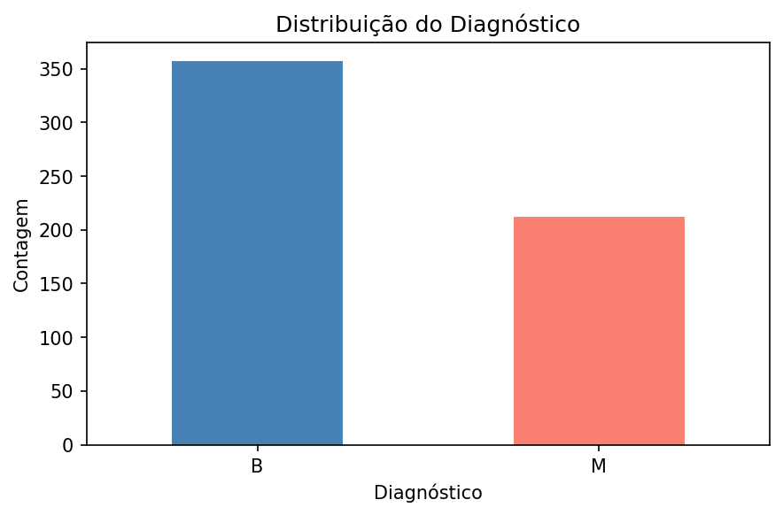
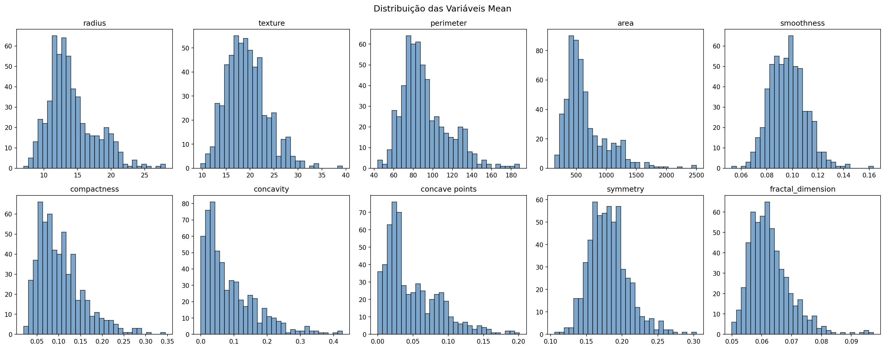
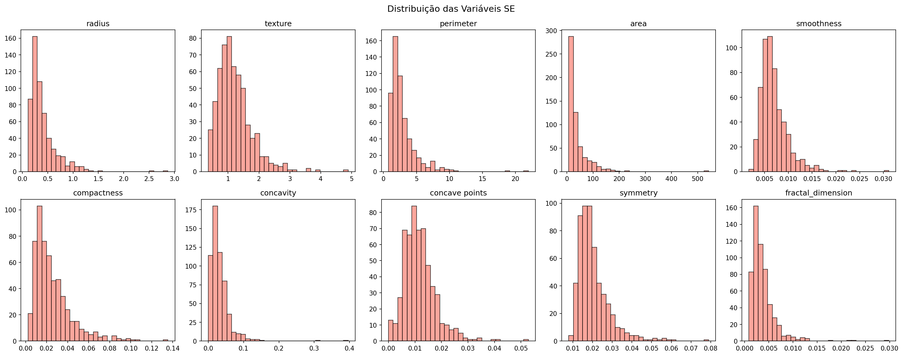
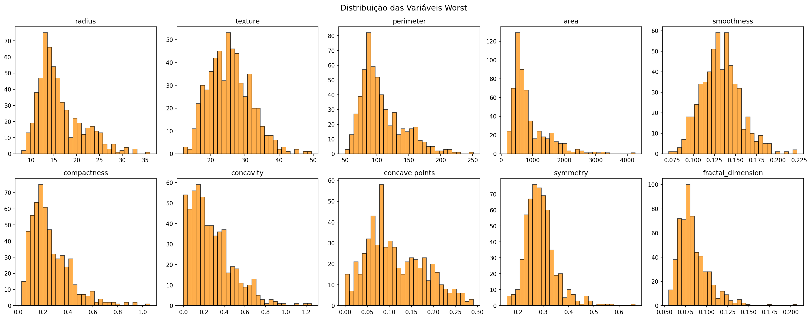
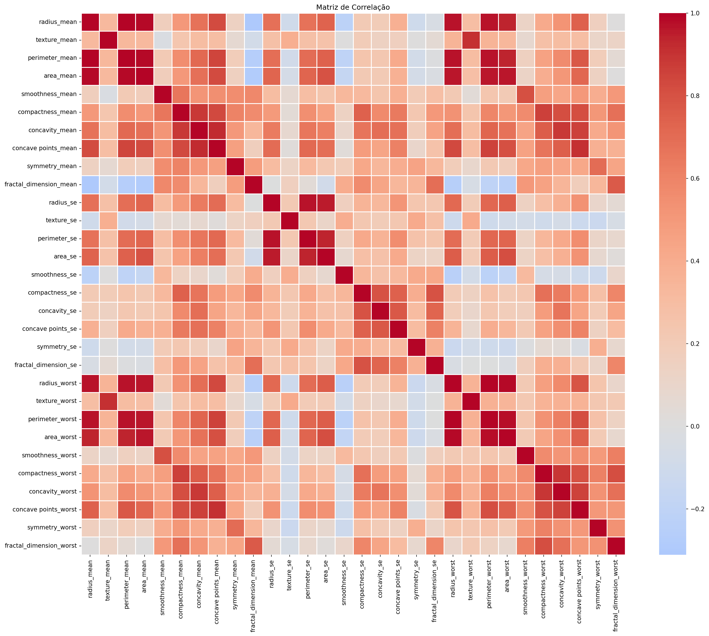
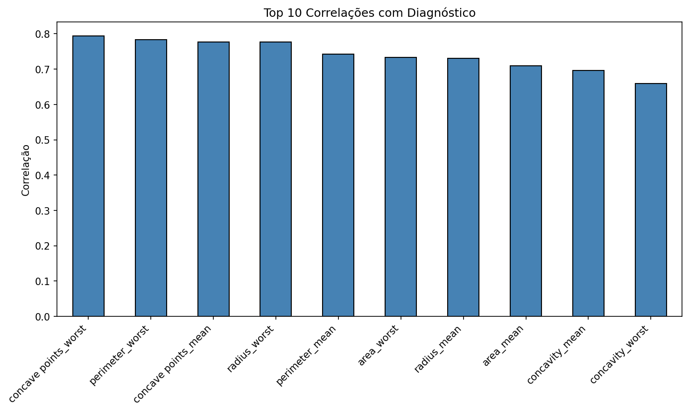
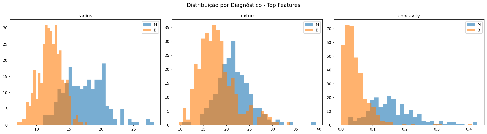
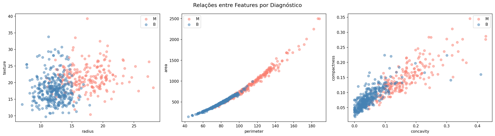
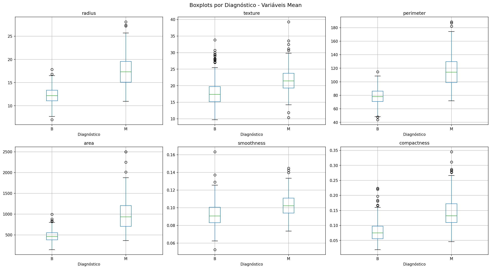

# Atividade 1

## Fundamentos

Nesta atividade, trabalhei com o **Wisconsin Diagnostic Cancer Dataset**, um conjunto de dados amplamente utilizado em machine learning para classificação de câncer de mama. O dataset contém características computadas a partir de imagens digitalizadas de aspirados por agulha fina (FNA) de amostras de tecido mamário.

### Sobre o Dataset

- **569 instâncias** (pacientes)
- **30 características numéricas** computadas dos núcleos celulares presentes nas imagens
- **Classificação binária**: Diagnóstico **Maligno (M)** ou **Benigno (B)**

### Estrutura dos Dados

As 30 características são organizadas em três grupos de 10 medidas cada:

| Grupo | Medidas |
|-------|---------|
| **Mean** (Média) | radius, texture, perimeter, area, smoothness, compactness, concavity, concave points, symmetry, fractal_dimension |
| **SE** (Erro Padrão) | radius, texture, perimeter, area, smoothness, compactness, concavity, concave points, symmetry, fractal_dimension |
| **Worst** (Pior/Máximo) | radius, texture, perimeter, area, smoothness, compactness, concavity, concave points, symmetry, fractal_dimension |

As medidas descrevem propriedades geométricas e morfológicas dos núcleos celulares, como tamanho, forma e textura.

## Descrição da Minha Análise

Realizei a análise exploratória usando Python com as bibliotecas **pandas**, **numpy**, **matplotlib** e **seaborn**. O notebook `wisconsin-cancer-analysis.ipynb` contém todo o código e análise completa que desenvolvi.

## Resultados da Análise

### 1. Visão Geral dos Dados

O dataset possui **569 registros** e **33 colunas** (incluindo `id`, `diagnosis` e a coluna `Unnamed: 32` que foi removida por conter apenas valores nulos). Não há valores faltantes nas colunas de características.

### 2. Distribuição do Diagnóstico

A distribuição do diagnóstico é desbalanceada:
- **Benigno (B):** 357 casos (62.7%)
- **Maligno (M):** 212 casos (37.3%)

### 3. Distribuição das Variáveis

As variáveis foram analisadas separadamente por grupo:

#### Variáveis Mean (Média)

#### Variáveis SE (Erro Padrão)

#### Variáveis Worst (Pior/Máximo)

### 4. Matriz de Correlação

A matriz de correlação revela as relações entre todas as variáveis numéricas:

**Observações importantes:**
- Existe uma **alta correlação positiva** entre variáveis do mesmo grupo (ex: `radius_mean`, `perimeter_mean` e `area_mean` estão fortemente correlacionadas)
- As variáveis `_worst` tendem a ter correlações mais fortes com o diagnóstico

### 5. Correlação com o Diagnóstico

Após codificar o diagnóstico (M=1, B=0), identifiquei as **Top 10 correlações** com o diagnóstico maligno:

| Feature | Correlação |
|---------|-----------|
| concave points_worst | 0.7936 |
| perimeter_worst | 0.7829 |
| concave points_mean | 0.7766 |
| radius_worst | 0.7765 |
| perimeter_mean | 0.7426 |
| area_worst | 0.7338 |
| radius_mean | 0.7300 |
| area_mean | 0.7090 |
| concavity_mean | 0.6964 |
| concavity_worst | 0.6596 |

### 6. Distribuição por Diagnóstico - Top Features

As variáveis com maior correlação mostram diferenças claras entre os diagnósticos:

### 7. Relações entre Features

### 8. Boxplots por Diagnóstico

## Tabelas Estatísticas

### Estatísticas Descritivas
Arquivo: `tabelas/wisconsin_estatisticas.csv`

### Distribuição do Diagnóstico
Arquivo: `tabelas/wisconsin_distribuicao_diagnostico.csv`

### Correlação com Diagnóstico
Arquivo: `tabelas/wisconsin_correlacao_diagnostico.csv`

## Minhas Conclusões

A análise exploratória que realizei do Wisconsin Diagnostic Cancer Dataset permitiu identificar diversas correlações entre as características dos núcleos celulares e o diagnóstico (Maligno ou Benigno):

1. **Concave points_worst** é a variável com maior correlação positiva com o diagnóstico maligno (r = 0.79)
2. Variáveis relacionadas ao **tamanho** dos núcleos celulares (perimeter, radius, area) mostram correlações fortes com o diagnóstico
3. As variáveis do grupo **_worst** (piores valores) são mais discriminativas que as médias
4. Existe uma **alta correlação entre variáveis do mesmo grupo**, sugerindo potencial para redução de dimensionalidade
5. As distribuições das principais características diferem significativamente entre casos benignos e malignos

Esses resultados são consistentes com o conhecimento médico: células malignas tendem a ser maiores, mais irregulares e com contornos mais concavos que células benignas.
